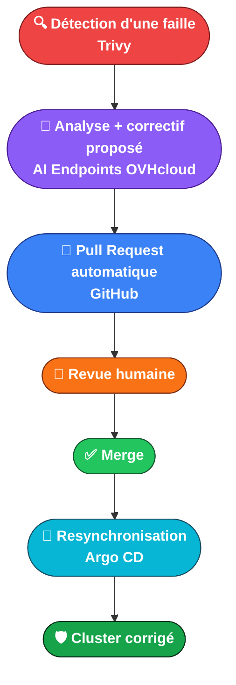
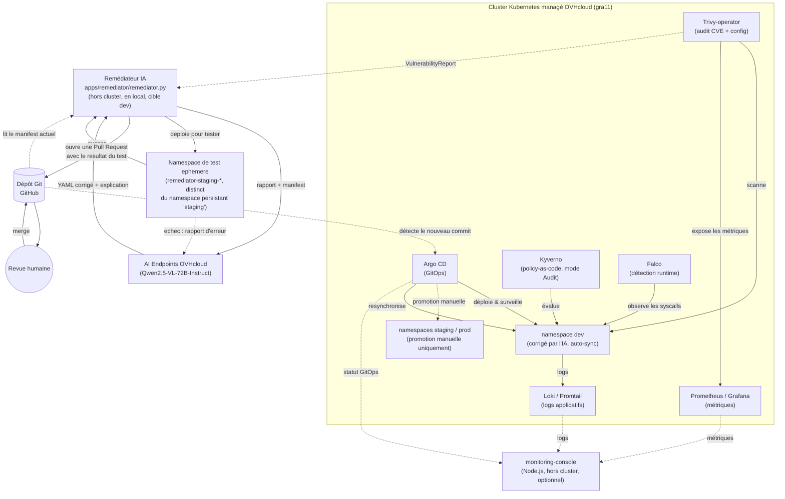

# Hackathon OVHcloud x Ynov - Équipe 7

Chaîne d'audit et de remédiation GitOps sécurisée sur Kubernetes, avec l'IA comme moteur actif
de détection, d'analyse et de correctif - pas un simple assistant.

**La boucle cible** :



---

## 1. Architecture

```
Cluster Kubernetes managé OVHcloud (hackathon-equipe-7, région gra11)
│
├── Argo CD (GitOps)              ── surveille le dépôt Git, applique tout automatiquement
├── Trivy-operator (audit)        ── scanne images (CVE) + configs, publie des CRD
├── Kyverno (policy-as-code)      ── évalue chaque ressource contre 3 policies (mode Audit)
├── Falco (runtime)               ── observe les syscalls, alerte sur comportement suspect
├── Prometheus / Grafana          ── collecte les métriques (dont trivy_image_vulnerabilities)
├── Loki / Promtail               ── agrège les logs applicatifs de tous les namespaces
│
├── Namespaces dev / staging / prod / ai-remediation
│     dev     = seul namespace corrigé par l'IA (Argo CD en auto-sync)
│     staging/prod = promotion manuelle uniquement (aucune synchro automatique)
│     ai-remediation = réservé au futur CronJob du remédiateur
│
└── Remédiateur (apps/remediator/remediator.py, tourne hors cluster, en local, cible dev)
        1. lit les VulnerabilityReport du namespace dev
        2. lit le manifest actuel depuis GitHub (Git = source de vérité, jamais le cluster)
        3. envoie rapport + manifest à l'IA (AI Endpoints OVHcloud)
        4. reçoit un YAML corrigé + une explication
        5. teste le correctif dans un namespace de staging éphémère (retente une fois
           auprès de l'IA si ça échoue, avec le rapport d'échec exact)
        6. ouvre une Pull Request GitHub, résultat du test inclus dans la description
                │
                ▼ revue humaine obligatoire + merge
        Dépôt Git (GitHub) ──► Argo CD détecte le changement ──► resynchronise dev

monitoring-console (Node.js, hors cluster, optionnel)
        dashboard qui interroge Argo CD + Prometheus + Loki pour afficher, par namespace,
        le statut GitOps, les métriques et les logs applicatifs — voir monitoring-console/README.md
```



*(Ce diagramme est au format [Mermaid](https://mermaid.js.org/) — GitHub le rend automatiquement
en visuel dans l'interface web, pas besoin d'image externe à maintenir.)*

**Pourquoi ce modèle est sûr (Zero Trust)** : ni l'IA ni le script remédiateur n'ont jamais
d'accès en écriture direct au cluster. Ils ne font que proposer un changement sur Git ; c'est
Argo CD - qui tourne dans le cluster, avec ses propres droits - qui l'applique réellement,
après qu'un humain a validé. Si l'IA se trompe, le pire qui puisse arriver est une PR erronée,
jamais une modification silencieuse du cluster.

**Justification des choix** (voir aussi `docs/architecture.md` pour le détail complet) :
- **Argo CD (pull, pas push)** : réduit la surface d'attaque, aucun credential cluster ne sort
  vers l'extérieur.
- **Trivy-operator plutôt que Kubescape** : rapports exposés comme des CRD Kubernetes standard,
  consommables directement par `kubectl` et par notre script Python.
- **Kyverno en mode `Audit`** (pas `Enforce`) : en `Enforce` il aurait bloqué la création même
  de notre workload volontairement vulnérable - choix pragmatique pour la durée du hackathon.
- **Falco avec driver `modern_ebpf`** : seul driver ne nécessitant pas de compilation de module
  noyau, donc compatible avec un cluster managé.
- **Loki plutôt qu'ELK/Fluentd** : projet CNCF (Incubating) de l'écosystème Grafana, cohérent
  avec Prometheus/Grafana déjà en place ; indexe uniquement les labels (pas le contenu), donc
  léger à faire tourner sur un cluster de hackathon.
- **monitoring-console (Node.js, hors cluster)** : petit dashboard qui agrège Argo CD +
  Prometheus + Loki par namespace — pas une brique de sécurité, mais un outil de démonstration
  pour visualiser en un coup d'œil l'état GitOps/métriques/logs de `dev`/`staging`/`prod`.
- **Revue humaine obligatoire avant merge** : le garde-fou central de toute l'architecture
  (voir les incidents réels racontés en §6).

## 2. Structure du dépôt

```
apps/
  vulnerable-app/
    dev/deployment.yaml            # workload cible, corrigé par l'IA (seul namespace qu'elle touche)
    staging/deployment.yaml        # copie promue manuellement après validation de dev
    prod/deployment.yaml           # copie promue manuellement après validation de staging
  remediator/                      # script IA : lecture Trivy, correctif IA, test staging, PR
    remediator.py
    test_ai_connection.py          # test isolé de connexion aux AI Endpoints
    README.md                      # comment lancer le remédiateur, variables d'env requises
    .venv/                         # environnement Python local (ignoré par Git)
infra/
  argocd-apps/                     # Applications Argo CD (pattern App-of-Apps)
    namespaces.yaml                # -> infra/namespaces/ (dev, staging, prod, ai-remediation)
    vulnerable-app-dev.yaml        # auto-sync (l'IA peut y corriger librement)
    vulnerable-app-staging.yaml    # promotion manuelle uniquement
    vulnerable-app-prod.yaml       # promotion manuelle uniquement
    trivy-operator.yaml
    kyverno.yaml
    policies.yaml
    prometheus.yaml
    falco.yaml
  namespaces/namespaces.yaml       # déclaration des 4 namespaces (dev/staging/prod/ai-remediation)
policies/                          # les 3 ClusterPolicy Kyverno
docs/
  architecture.md                  # rapport d'architecture + tableau CNCF + vision SLA/staging
  demo-script.md                   # script de démo complet (backstage, rejeu, déroulé, limites)
  team-testing-guide.md            # guide pour qu'un coéquipier valide la stack sur son poste
  commands-reference.md            # aide-mémoire de toutes les commandes utilisées
root-app.yaml                      # Application Argo CD racine (App-of-Apps)
.env.example                       # modèle de variables d'environnement (committé, sans secrets)
.env                                # variables reelles (ignoré par Git, jamais commité)
```

**Modèle dev → staging → prod** : le remédiateur ne lit et ne corrige que le namespace `dev`
(garde-fou explicite dans `remediator.py` : il refuse de s'exécuter si on le pointe vers
`staging` ou `prod`). Les Applications `vulnerable-app-staging` et `vulnerable-app-prod` n'ont
volontairement **pas** de `syncPolicy.automated` — leur promotion se fait uniquement par un
commit humain qui copie le contenu validé de l'environnement précédent. Cette structure a été
initiée par un membre de l'équipe en parallèle, puis intégrée et adaptée ici.

**Le pattern App-of-Apps** : `root-app.yaml` est la seule Application appliquée manuellement
sur le cluster. Elle surveille le dossier `infra/argocd-apps/` : chaque fichier YAML qu'on y
ajoute devient automatiquement une nouvelle Application Argo CD, sans jamais retoucher au
cluster à la main. Ajouter un outil = ajouter un fichier + `git push`.

## 3. Étapes de construction (dans l'ordre réel)

1. **Préparation du poste** : installation de `kubectl`, `helm`, `gh`, `kubectx`, `k9s`, `argocd`
   CLI (dans `~/.local/bin`, pas de droits sudo sur ce poste). Copie du kubeconfig équipe dans
   `~/.kube/config`, vérification `kubectl get nodes`.
2. **Dépôt Git** : création de l'arborescence (`apps/`, `infra/argocd-apps/`, `policies/`,
   `docs/`), premier commit.
3. **Argo CD** : `kubectl create namespace argocd` + apply des manifests stables - **la seule
   fois où on installe quelque chose avec `kubectl apply` en direct**. Récupération du mot de
   passe admin initial, connexion CLI et UI.
4. **Connexion du dépôt Git à Argo CD** (`argocd repo add` - le dépôt est public, donc pas de
   credentials nécessaires pour la lecture).
5. **Première Application "hello world"** (`apps/vulnerable-app/deployment.yaml` avec un nginx
   sain) pour valider que la boucle GitOps de base fonctionne.
6. **Pattern App-of-Apps** : création de `root-app.yaml`, appliqué une seule fois - **dernier
   `kubectl apply` manuel de tout le hackathon**. À partir de là, tout passe par Git.
7. **Déploiement du workload volontairement vulnérable** : remplacement du deployment sain par
   une version à 4 familles de failles (image `nginx:1.14` obsolète, `privileged: true`,
   `runAsUser: 0`, aucune limite de ressources).
8. **Trivy-operator** installé via une Application Argo CD (chart Helm officiel). Vérification :
   des dizaines de CVE CRITICAL/HIGH détectées sur l'image.
9. **Kyverno** installé en mode `Audit`, avec 3 policies (`disallow-privileged`,
   `require-limits`, `disallow-latest-tag`). Vérification : 2 violations détectées sur l'app
   vulnérable.
10. **Prometheus / Grafana** (`kube-prometheus-stack`) installé, avec le `ServiceMonitor` de
    Trivy activé pour exposer la métrique `trivy_image_vulnerabilities`.
11. **Falco** installé (driver `modern_ebpf`, UI `falcosidekick` activée). Test : ouverture d'un
    shell dans le conteneur vulnérable + lecture de `/etc/shadow` → alerte Falco confirmée.
12. **AI Endpoints OVHcloud** : récupération du modèle (`Qwen2.5-VL-72B-Instruct`, seul modèle
    disponible pour ce hackathon) et de son URL de base, premier appel de test réussi.
13. **Développement du remédiateur** (`apps/remediator/remediator.py`) : lit les rapports Trivy,
    lit le manifest sur GitHub, demande un correctif à l'IA, ouvre une Pull Request.
14. **Test de la boucle complète** : exécution du remédiateur → PR ouverte automatiquement →
    revue humaine (ajustement vers une image `alpine`) → merge → Argo CD resynchronise → un bug
    réel est découvert (le conteneur ne démarre plus en non-root, faute de volumes inscriptibles)
    → corrigé → cluster validé sain (0 CVE CRITICAL/HIGH, 3/3 policies Kyverno passent).
15. **Documentation** : rapport d'architecture, tableau CNCF, script de démo.
16. **Rejeu de la démo devant le jury** : un second incident survient (l'IA propose le tag
    `nginx:latest`, que notre policy Kyverno `disallow-latest-tag` signale en violation) —
    corrigé manuellement. Le jury demande ensuite comment garantir le SLA et éviter qu'un
    correctif casse la prod.
17. **Amélioration du remédiateur** : ajout d'un test de staging automatique (déploiement réel
    dans un namespace éphémère, isolé du reste, avec retentative informée par l'échec auprès
    de l'IA), d'une garde anti-doublon de PR, et d'un rapport d'architecture enrichi d'une
    section Vision (SLA, staging → canary avec Argo Rollouts) — réponse concrète, pas juste
    orale, aux questions du jury.
18. **Intégration du travail d'un coéquipier sur dev/staging/prod** : migration du namespace
    unique `demo` vers un modèle à trois environnements (`dev` auto-corrigé par l'IA, `staging`
    et `prod` en promotion manuelle uniquement), avec un namespace `ai-remediation` dédié pour
    une future automatisation par `CronJob`. Le remédiateur cible désormais `dev` via des
    variables d'environnement configurables (`TARGET_NAMESPACE`, `MANIFEST_PATH`) et refuse
    explicitement de s'exécuter sur `staging`/`prod`.

## 4. Accéder aux outils

Tous les outils sont internes au cluster - on y accède via `kubectl port-forward`, chacun dans
un terminal séparé. **Aucun mot de passe n'est écrit en clair dans ce dépôt** : chaque valeur est
définie manuellement (pas générée automatiquement — certains charts, comme celui de Grafana,
régénèrent sinon un mot de passe aléatoire différent à chaque sync Argo CD), stockée dans un
Secret Kubernetes créé hors Git et référencée via `existingSecret` dans les values Helm.

**Étape unique, une seule fois** : copier `.env.example` en `.env` (déjà ignoré par Git) et
remplir chaque valeur avec la commande `kubectl` indiquée en commentaire dans le fichier — ou en
la demandant directement à l'équipe, puisque ce sont des valeurs fixes et partageables.
Ensuite, `source .env` dans un terminal exporte tout d'un coup :

| Outil | Commande | URL | Utilisateur | Mot de passe |
|---|---|---|---|---|
| Argo CD | `kubectl port-forward svc/argocd-server -n argocd 8080:443` | https://localhost:8080 | `admin` | `$ARGOCD_ADMIN_PASSWORD` |
| Grafana | `kubectl port-forward svc/kube-prometheus-stack-grafana -n monitoring 3000:80` | http://localhost:3000 | `admin` | `$GRAFANA_ADMIN_PASSWORD` |
| Prometheus | `kubectl port-forward svc/kube-prometheus-stack-prometheus -n monitoring 9090:9090` | http://localhost:9090 | — | — |
| Falco UI | `kubectl port-forward svc/falco-falcosidekick-ui -n falco 2802:2802` | http://localhost:2802 | `$FALCO_UI_USER` | `$FALCO_UI_PASSWORD` |
| Loki | `kubectl port-forward svc/loki -n monitoring 3100:3100` | http://localhost:3100 | — | — |
| monitoring-console | `cd monitoring-console/backend && npm install && npm start` (nécessite les tunnels Argo CD/Prometheus/Loki actifs) | http://localhost:4000 | — | — |

**Rapports de sécurité** (pas d'UI dédiée - ce sont des CRD Kubernetes natives, consultables
avec `kubectl` depuis n'importe où) :
```bash
kubectl get vulnerabilityreports -A       # CVE détectées par Trivy
kubectl get configauditreports -A         # mauvaises pratiques de config détectées par Trivy
kubectl get policyreports -A              # violations détectées par Kyverno
kubectl logs -n falco -l app.kubernetes.io/name=falco --tail=50 | grep -i warning   # alertes Falco
```

**Piège rencontré plusieurs fois : un tunnel "vivant" mais qui ne répond plus.** Après une
coupure réseau ou une mise en veille du poste, `kubectl port-forward` peut laisser un processus
actif en apparence (visible dans `ps aux`) qui ne transmet plus rien. Symptôme : la page web ne
charge pas, sans message d'erreur clair. Diagnostic et correction :
```bash
curl -sk -o /dev/null -w "%{http_code}\n" http://localhost:3000   # 000 = tunnel mort
pkill -f "kubectl port-forward"                                   # tue tous les tunnels
# puis relancer chaque port-forward normalement
```

## 5. Le remédiateur IA - comment le lancer

Voir `apps/remediator/README.md` pour le détail complet. En résumé :

```bash
cd apps/remediator
python3 -m venv .venv                                        # une seule fois
.venv/bin/pip install openai kubernetes PyGithub pyyaml      # une seule fois

source ../../.env       # charge OVH_AI_TOKEN, OVH_AI_BASE_URL, OVH_AI_MODEL, GITHUB_TOKEN, GITHUB_REPO
.venv/bin/python remediator.py
```

Le script affiche le rapport résumé, l'explication de l'IA, le résultat du **test de staging
automatique** (déploiement réel dans un namespace éphémère avant toute PR — voir §6), puis l'URL
de la Pull Request. **Elle doit être relue par un humain avant d'être mergée** - ce n'est jamais
automatique, c'est le garde-fou central de l'architecture.

## 6. Incidents réels rencontrés (bons exemples pour la soutenance)

**1. Le conteneur non-root sans volume inscriptible.** Le premier correctif proposé par l'IA
passait le conteneur en utilisateur non-root - bonne pratique de sécurité, mais qui a cassé le
démarrage de nginx (`/var/cache/nginx/client_temp` non accessible en écriture sans volume
dédié). Merge effectué, Argo CD a resynchronisé, le pod est parti en `CrashLoopBackOff`. Corrigé
en ajoutant deux volumes `emptyDir` (`/var/cache/nginx`, `/var/run`) — **deux fois de suite**, le
même piège s'est reproduit lors d'un rejeu de la démo.

**2. Le tag `:latest` qui viole notre propre policy.** Un correctif ultérieur proposait
`nginx:latest` - Kyverno (`disallow-latest-tag`, mode `Audit`) l'a signalé en violation sans
bloquer le merge, que la revue humaine avait laissé passer. Bon exemple de la complémentarité
(imparfaite) de plusieurs garde-fous.

**Conséquence concrète** : ces deux incidents ont motivé l'ajout d'un **test de staging
automatique** dans le remédiateur (§7 de `docs/architecture.md`) — chaque correctif est
maintenant réellement déployé dans un namespace jetable avant d'ouvrir la PR, avec une
retentative auto-corrigée par l'IA en cas d'échec. **C'est exactement pour ce genre de cas que
la revue humaine reste indispensable, et que l'architecture a été renforcée en conséquence** -
une automatisation à 100 % sans contrôle aurait pu casser la production silencieusement.

## 7. Statut CNCF des composants

| Composant | Rôle | Statut CNCF |
|---|---|---|
| Argo CD | GitOps | Graduated |
| Trivy-operator | Audit de sécurité | Projet Aqua Security, scanner validé CNCF |
| Kyverno | Policy-as-code | Graduated |
| Falco | Détection runtime | Graduated |
| Prometheus | Observabilité | Graduated |
| AI Endpoints OVHcloud | Couche IA générative | OVHcloud (hors CNCF, assumé dans le brief) |

## 8. Limites connues

Voir `docs/architecture.md` §6-7 et `docs/demo-script.md` §E pour le détail : déclenchement
manuel du remédiateur (une vraie prod utiliserait un `CronJob`), secrets passés en variables
d'environnement plutôt que via un `Secret` Kubernetes + External Secrets Operator, un seul
rapport traité par exécution. La validation avant merge, elle, est réellement implémentée : le
remédiateur teste chaque correctif dans un namespace de staging éphémère avant d'ouvrir la PR
(voir `apps/remediator/README.md` et `docs/architecture.md` §7).

## 9. Documentation complémentaire

- `docs/rapport-architecture.md` - **le livrable officiel demandé par le brief** : rapport
  d'architecture concis (1-2 pages) + tableau récapitulatif du statut CNCF
- `docs/architecture.md` - version détaillée et complète (référence technique/Q&A, plus longue
  que 1-2 pages) : mêmes sujets, incidents réels, vision SLA/staging développée
- `docs/demo-script.md` - script de démo complet de A à Z (backstage, déroulé minuté, rejeu)
- `docs/team-testing-guide.md` - guide pour qu'un coéquipier vérifie la stack sur son poste
- `docs/commands-reference.md` - aide-mémoire de toutes les commandes utilisées pendant le hackathon
- `apps/remediator/README.md` - documentation détaillée du remédiateur (dont le test de staging)
- `monitoring-console/README.md` - dashboard optionnel (Node.js, hors cluster) montrant l'état
  GitOps + métriques par namespace ; `cd monitoring-console/backend && npm install && npm start`
